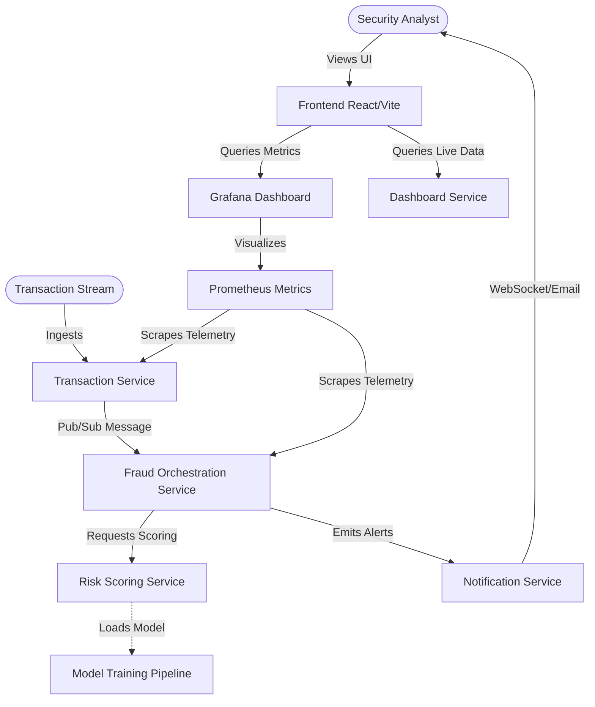

# 🛡️ AI Fraud Detection Project Guide: Architectural Overview

Welcome! This guide explains exactly what this project is, how it is currently structured, how the live dashboard mockup functions, and the ultimate architectural vision for the system.

---

## 📋 Executive Summary
This repository represents the scaffolding for an **Enterprise-Grade AI Fraud Detection & Live Monitoring System**. 

The system is designed to ingest real-time financial transaction streams, pass them through machine learning models (specifically an **Isolation Forest** model), calculate dynamic risk scores, and present live, actionable security alerts to system administrators on a glassmorphic dark-mode dashboard.

---

## 🔍 Current Project State (Mockup vs. Scaffolding)

Currently, the project contains two main parts:

1. **A High-Fidelity Active Simulation Mockup ([preview.html](file:///Users/sandew/Documents/ANTIGRAVITY/FRUAD/preview.html))**: 
   * This is a fully functional, self-contained interactive web page that runs a real-time transaction simulator in the browser. 
   * It uses modern styling via TailwindCSS and live plotting via Chart.js to visualize exactly what the finished, integrated production dashboard will look like.
2. **Planned Architectural Scaffolding**: 
   * The directory contains multiple folders ([backend/](file:///Users/sandew/Documents/ANTIGRAVITY/FRUAD/backend/), [frontend/](file:///Users/sandew/Documents/ANTIGRAVITY/FRUAD/frontend/), [grafana/](file:///Users/sandew/Documents/ANTIGRAVITY/FRUAD/grafana/), [prometheus/](file:///Users/sandew/Documents/ANTIGRAVITY/FRUAD/prometheus/)) that outline a robust, production-grade microservice architecture. 
   * These folders are currently empty scaffolds or placeholders ready for actual development.

---

## 🕹️ Deep Dive: The Live Simulator ([preview.html](file:///Users/sandew/Documents/ANTIGRAVITY/FRUAD/preview.html))

When you run this project, you see the active simulator in action. Under the hood, this file performs several key actions:

### 1. Real-Time Transaction Engine
A JavaScript loop runs every **1.2 seconds**, generating simulated transactions. Each transaction goes through an artificial classification model:
* **85% Healthy Transactions**: Low risk score ($0\text{--}25$), auto-approved with standard telemetry checks green.
* **15% Anomalous Transactions**: Triggers rules that classify them into:
  * ⚠️ **FLAG**: Medium risk score ($60\text{--}84$) for events like *Unusual amount relative to mean* or *New merchant device*.
  * 🚫 **BLOCK**: High risk score ($85\text{--}100$) for severe flags like *Isolation Forest Score > 0.92*, *Velocity > 500% usual*, or *Offshore IP detected*.

### 2. Live Interactive Visuals
* **Line Chart (Chart.js)**: Plots the timeline of the live transaction anomaly risk scores. When a high-risk event is blocked, the line chart's border dynamically flashes red (or amber for warnings) to visually alert the operator.
* **Alert Feed**: Maintains a rolling stream of the last 15 security alerts, displaying specific transaction IDs and granular reasons for why the AI model chose to approve, flag, or block the transaction.
* **System Status Indicator**: A pulse-animation dot in the upper-right corner mimics a live WebSocket connection heartbeat (flashing red temporarily when an active block occurs).

---

## 🏛️ Future Vision: The Planned Microservices Architecture

The scaffolding directories outline a comprehensive system designed to scale. Here is what each folder is meant to achieve when built out:

### 🖥️ 1. [frontend/](file:///Users/sandew/Documents/ANTIGRAVITY/FRUAD/frontend/)
Designed to house a modern React application built on Vite and TailwindCSS:
* **Current Files**: Contains basic [postcss.config.cjs](file:///Users/sandew/Documents/ANTIGRAVITY/FRUAD/frontend/postcss.config.cjs) and [src/index.css](file:///Users/sandew/Documents/ANTIGRAVITY/FRUAD/frontend/src/index.css).
* **Dependencies**: Standard modern UI packages are already pre-installed in its `node_modules` folder (like `recharts` for charts, `lucide-react` for icons, and `react-dom`).

### ⚙️ 2. [backend/](file:///Users/sandew/Documents/ANTIGRAVITY/FRUAD/backend/)
Divided into 8 microservices, organizing concerns cleanly:
1. **`auth_service`**: Manages analyst logins, multi-factor authentication, and security credentials.
2. **`transaction_service`**: Ingests financial transactions (from card networks, banks) at high volume and verifies basic structural rules.
3. **`fraud_service`**: The central orchestrator that guides transactions through the scoring process and saves audit logs.
4. **`risk_scoring_service`**: Runs the live transactions against machine learning models (e.g., Python-based Isolation Forests) to calculate real-time risk scores.
5. **`model_training`**: An offline pipeline that trains newer versions of the machine learning model on historical transaction datasets.
6. **`notification_service`**: Publishes high-risk events to communication channels (SMS, Email, Slack, or WebSockets).
7. **`dashboard_service`**: A REST/GraphQL API gateway supplying live summaries, stats, and historical logs to the React frontend.
8. **`shared`**: Code libraries, database schemas, and protocols shared among all backend microservices.

### 📊 3. [prometheus/](file:///Users/sandew/Documents/ANTIGRAVITY/FRUAD/prometheus/) & [grafana/](file:///Users/sandew/Documents/ANTIGRAVITY/FRUAD/grafana/)
Provide deep observability into the backend infrastructure:
* **Prometheus**: Collects system health metrics (RAM usage, API latencies, CPU spikes) from each running microservice.
* **Grafana**: Pulls data from Prometheus to display operations-level health charts for dev-ops teams monitoring microservice performance.

---

## 🛠️ How to Transition Mockup to Production

To bring this microservices architecture to life, you would:
1. **Implement Frontend in React**: Scaffold standard React files in [frontend/src/](file:///Users/sandew/Documents/ANTIGRAVITY/FRUAD/frontend/src/) and link them to the installed Tailwind configs to recreate the mockup's UI using robust components (`Recharts` instead of static HTML `Chart.js`).
2. **Create backend APIs**: Build API endpoints inside the [backend/](file:///Users/sandew/Documents/ANTIGRAVITY/FRUAD/backend/) directories using Node.js (Express/Fastify) or Python (FastAPI).
3. **Establish Data Streaming**: Use a broker like Apache Kafka or RabbitMQ to stream transactions from `transaction_service` -> `fraud_service` -> `risk_scoring_service` in real-time.
